## Index

- [Beginning](#beginning)
  - [What is K8s?](#what-is-k8s)
  - [Which GNU/Linux distro should I use?](#which-gnulinux-distro-should-i-use)
  - [Website recommendation](#website-recommendation)
  - [Kubernetes Components](#kubernetes-components)
  - [Network ports](#network-ports)
  - [Which application should I run in a K8s cluster?](#which-application-should-i-run-in-a-k8s-cluster)
  - [Key Concepts](#key-concepts)
- [Simple Kubernetes Deployment](#simple-kubernetes-deployment)
  - [Requirements](#requirements)
- [First steps on K8s](#first-steps-on-k8s)
  - [Checking the deployment](#checking-the-deployment)
  - [Checking the namespace and pods](#checking-the-namespace-and-pods)
  - [Running our first pod](#running-our-first-pod)
  - [Checking the latest events on the cluster](#checking-the-latest-events-on-the-cluster)
  - [Dump a k8s object to YAML](#dump-a-k8s-object-to-yaml)
  - [Removing a pod](#removing-a-pod)
  - [Create a pod using a YAML file](#create-a-pod-using-a-yaml-file)
  - [Using dry-run option](#using-dry-run-option)
  - [Show documentation about Kubernetes resources](#show-documentation-about-kubernetes-resources)
  - [Create a Service object that exposes the pod](#create-a-service-object-that-exposes-the-pod)
  - [Clean up everything](#clean-up-everything)

# Beginning

## What is K8s?

The Kubernetes project was developed by Google in 2014 ish. The name Kubernetes originates from Greek, meaning `helmsman` or `pilot`, and is an open-source container orchestration system for automating software deployment, scaling, and management. Which was designed based on <a href=https://kubernetes.io/blog/2015/04/borg-predecessor-to-kubernetes/> Borg </a> project.

Kubernetes is often abbreviated as K8s, counting the eight letters between the "K" and the "s".

## Which GNU/Linux distro should I use?

Due to some important tools such as, `systemd` and `journald`, having become standard on the main Linux distributions, there is no issue running the deployment described here on `Ubuntu`, `Debian`, `CentOS` or others.

For the purpose of this tutorial, we'll run instances of a Ubuntu-based Linux distribution and a user with sudo privileges.

## Website recommendation

- https://kubernetes.io
- https://github.com/kubernetes/kubernetes/
- https://github.com/kubernetes/kubernetes/issues

## Kubernetes Components

As with other managing containers orchestrators, K8s follows the model of _control plane/workers_ that consists of a Kubernetes cluster. Every cluster has at least one worker node.

At least three _nodes_ are recommended in a production environment:

- 1 `control-plane` responsible for the manager the cluster
- 2 `workers` responsible to run the applications in the cluster.

You can create a K8s cluster using just one node, but it's recommended only for study purposes. There are some solutions where you can create the cluster on your local machine, such as:

- <a href=https://kind.sigs.k8s.io/docs/user/quick-start/>_Kind_ </a>
- <a href=https://github.com/kubernetes/minikube>_Minikube_ </a>
- <a href=https://microk8s.io/>_MicroK8s_ </a>
- <a href=https://k3s.io/>_K3s_ </a>
- <a href=https://k0sproject.io/>_K0s_ </a>

The below image describes the components of a Kubernetes cluster

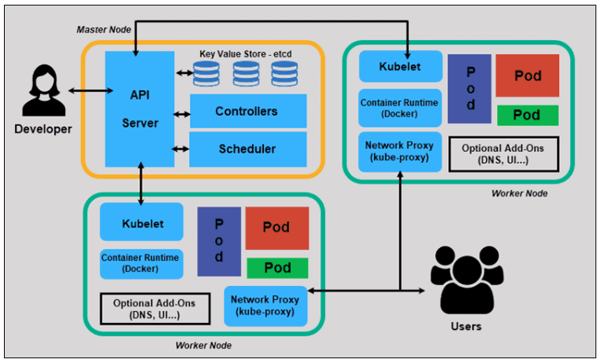

<a href=https://phoenixnap.com/kb/understanding-kubernetes-architecture-diagrams>Kubernetes Components </a>

<u>**API Server:**</u>

The API server is a component of the Kubernetes control plane that exposes the Kubernetes API. The API server is the front end for the Kubernetes control plane.

Internal system components, as well as external user components, all communicate via the same API.

<u>**etcd:**</u>

Consistent and highly-available key value store used as Kubernetes' backing store for all cluster data, also called `etcd`.

If your Kubernetes cluster uses etcd as its backing store.

The Master node queries etcd to retrieve parameters for the state of the nodes, pods, and containers.

<u>**Scheduler:**</u>

A Scheduler watches for new requests coming from the API Server and assigns them to healthy nodes.

Factors taken into account for scheduling decisions include: individual and collective resource requirements, hardware/software/policy constraints, affinity and anti-affinity specifications, data locality, inter-workload interference, and deadlines.

If there are no suitable nodes, the pods are put in a pending state until such a node appears.

<u>**Controller Manager:**</u>

The role of the Controller is to obtain the desired state from the API Server. It checks the current state of the nodes it is tasked to control, and determines if there are any differences, and resolves them, if any.

<u>**Kubelet:**</u>

An agent that runs on each node in the cluster. It makes sure that containers are running in a Pod.

By installing kubelet, the node’s CPU, RAM, and storage become part of the broader cluster. It watches for tasks sent from the API Server, executes the task, and reports back to the Master. It also monitors pods and reports back to the control panel if a pod is not fully functional. Based on that information, the Master can then decide how to allocate tasks and resources to reach the desired state.

<u>**Kube-proxy:**</u>

The kube-proxy makes sure that each node gets its IP address, implements local iptables and rules to handle routing and traffic load-balancing.

Kube-proxy maintains network rules on nodes. These network rules allow network communication to your Pods from network sessions inside or outside of your cluster.

<u>**Container Runtime:**</u>

The container runtime is the software that is responsible for running containers.

The container runtime pulls images from a container image registry and starts and stops containers. A 3rd party software or plugin, such as Docker, usually performs this function.

## Network ports

<u>**CONTROL PLANE**</u>

| Protocol | Direction | Port Range | Purpose                 | Used By              |
| -------- | --------- | ---------- | ----------------------- | -------------------- |
| TCP      | Inbound   | 6443\*     | Kubernetes API server   | All                  |
| TCP      | Inbound   | 2379-2380  | etcd server client API  | kube-apiserver, etcd |
| TCP      | Inbound   | 10250      | Kubelet API             | Self, Control plane  |
| TCP      | Inbound   | 10251      | kube-scheduler          | Self                 |
| TCP      | Inbound   | 10252      | kube-controller-manager | Self                 |

\* = Customized port

<u>**WORKERS**</u>

| Protocol | Direction | Port Range  | Purpose     | Used By             |
| -------- | --------- | ----------- | ----------- | ------------------- |
| TCP      | Inbound   | 10250       | Kubelet API | Self, Control plane |
| TCP      | Inbound   | 30000-32767 | NodePort    | Services All        |

## Which application should I run in a K8s cluster?

The best application methodology to run in a container, are applications that follow <a href=https://12factor.net/>The twelve-factor app</a> design

## Key Concepts

Kubernetes is a portable, extensible, open source platform for managing containerized workloads and services, that facilitates both declarative configuration and automation. It has a large, rapidly growing ecosystem. Kubernetes services, support, and tools are widely available.

Let's see the main concepts in the K8s environment:

<u>**Pod:**</u>

_Pods_ are the smallest deployable units of computing that you can create and manage in Kubernetes. Without it, a container cannot be part of a cluster. If you need to scale your app, you can only do so by adding or removing pods. One pod can have multiple containers.

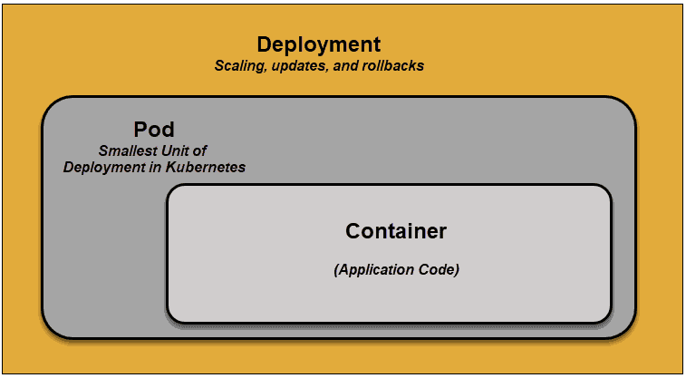

<u>**Deployment:**</u>

A Kubernetes deployment is a resource object in Kubernetes that provides declarative updates to applications

Deployment tells Kubernetes how to create or modify instances of the pods that hold a containerized application. A deployment allows you to describe an application’s life cycle, such as which images to use for the app, the number of pods there should be, and the way in which they should be updated.

<u>**ReplicaSets:**</u>

A ReplicaSet's purpose is to maintain a stable set of replica Pods running at any given time. As such, it is often used to guarantee the availability of a specified number of identical Pods.

A ReplicaSet ensures that a specified number of pod replicas are running at any given time. However, a `Deployment` is a higher-level concept that manages `ReplicaSets` and provides declarative updates to Pods along with a lot of other useful features.

<u>**Services:**</u>

The idea of a Service is to group a set of Pod endpoints into a single resource. You can configure various ways to access the grouping. By default, you get a stable cluster IP address that clients inside the cluster can use to contact Pods in the Service. A client sends a request to the stable IP address, and the request is routed to one of the Pods in the Service.

Services are introduced to provide reliable networking by bringing stable IP addresses and DNS names to the unstable world of pods.

By controlling traffic coming and going to the pod, a Kubernetes service provides a stable networking endpoint – a fixed IP, DNS, and port. Through a service, any pod can be added or removed without the fear that basic network information would change in any way.

<u>**Controller:**</u>

In Kubernetes, controllers are control loops that watch the state of your cluster, then make or request changes where needed. Each controller tries to move the current cluster state closer to the desired state. `Deployments` is an example of this class.

<u>**Jobs e CronJobs:**</u>

CronJob is meant for performing regular scheduled actions such as backups, report generation, and so on.

# Easy Kubernetes Deployment

Minikube is a great way to start learning how to work with Kubernetes.

You can deploy Minikube on Linux, macOS, and Windows. We’ll demonstrate on Ubuntu Linux. With this tutorial, you should be able to get a Kubernetes environment up and running in less than 15 minutes.

## Requirements

For the purpose of the study, this will be deployed using Vagrant + VirtualBox + Ansible.

- <a href=https://developer.hashicorp.com/vagrant/downloads>Install Vagrant</a>
- <a href=https://docs.ansible.com/ansible/latest/installation_guide/intro_installation.html>Install Ansible</a>
- <a href=https://www.virtualbox.org/wiki/Mac%20OS%20X%20build%20instructions>Install VirtualBox</a>

The below diagram describes the infrastructure. We'll use 1 master and 1 node.

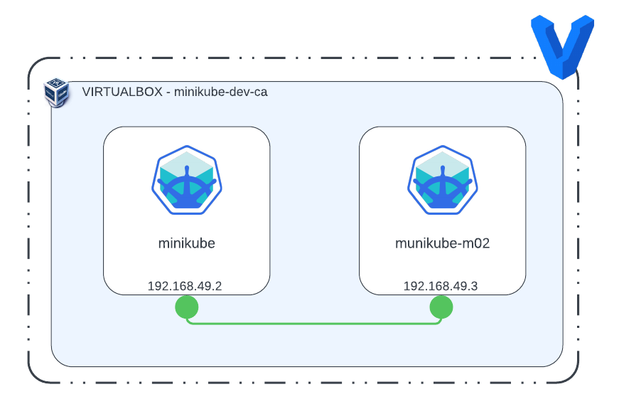

Clone the repo and access the `simplifying-minikube` folder.

If all prerequisites are met, start the cluster with the command `sudo vagrant up`

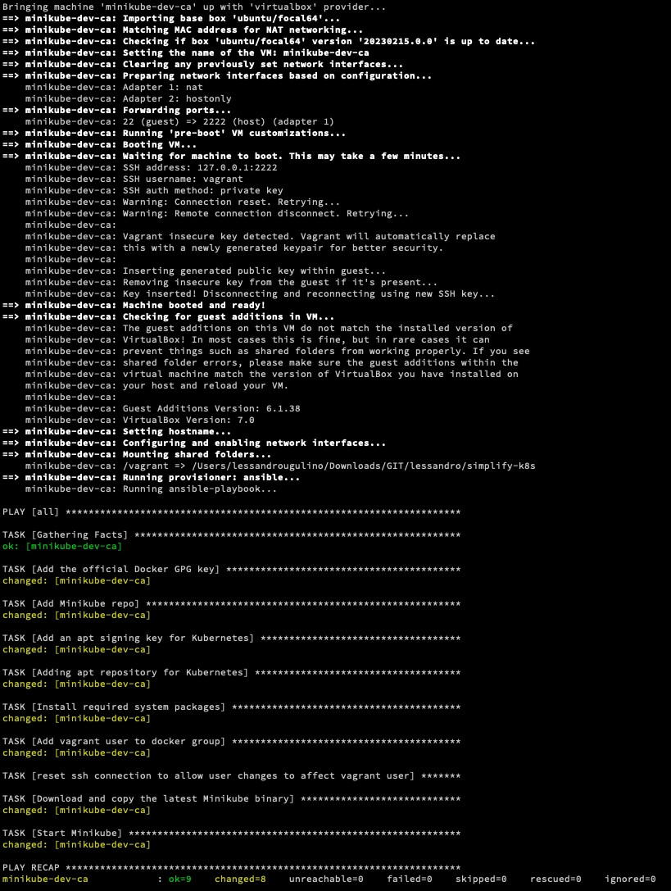

## First steps on K8s

### Checking the deployment

Access the Server using `sudo vagrant ssh`

Check the status of the nodes with the command:
`kubectl get nodes -o wide`

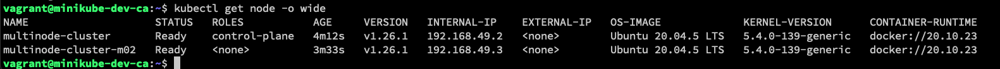

### Checking the namespace and pods

`kubectl get namespaces`

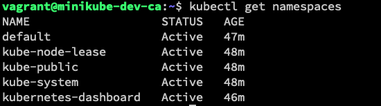

`kubectl get pod -A`

**-A** -> all namespaces

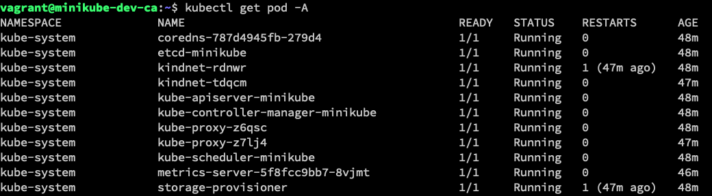

`kubectl get pod -n kube-system`

**-n** -> get the pods in the `kube-system` namespace

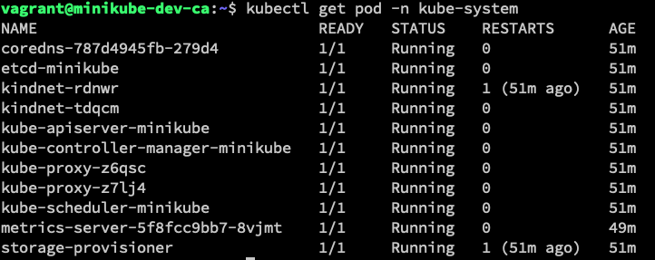

### Running our first pod

`kubectl run nginx --image nginx`

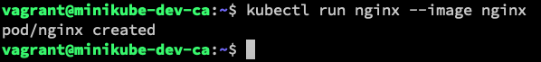

List the pods: `kubectl get pod`

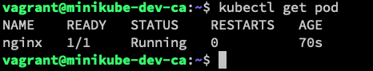

Describes a resource in Kubernetes: `kubectl describe pod nginx`

### Checking the latest events on the cluster

`kubectl get events`

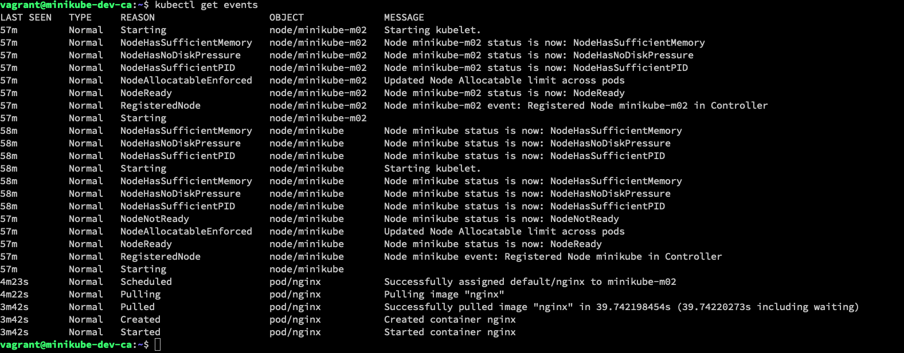

### Dump a k8s object to YAML

`kubectl get pod nginx -o yaml > my-first-pod.yaml`

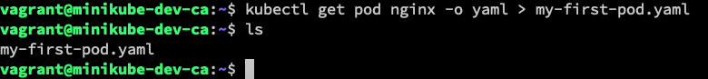

A `YAML` file will be generated as shown above. You can edit this file using `vim`.

### Removing a pod

`kubectl delete pod nginx`

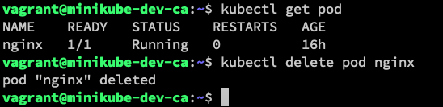

### Create a pod using a YAML file

Let's use the YAML file generated before to create the pod.

`kubectl create -f my-first-pod.yaml`

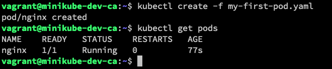

### Using dry-run option

`kubectl run my-nginx --image nginx --dry-run=client -o yaml > pod-template-dry-run.yaml`

The option `--dry-run=client` will let the bash know that the command will not be actually executed. `-o yaml` points out that the output will be formatted as a yaml file and finally with the `> pod-template-dry-run.yaml` we redirect the output to a yaml file with the name `pod-template-dry-run.yaml`.

This option will generate a much cleaner file than the command without `--dry-run=client`.

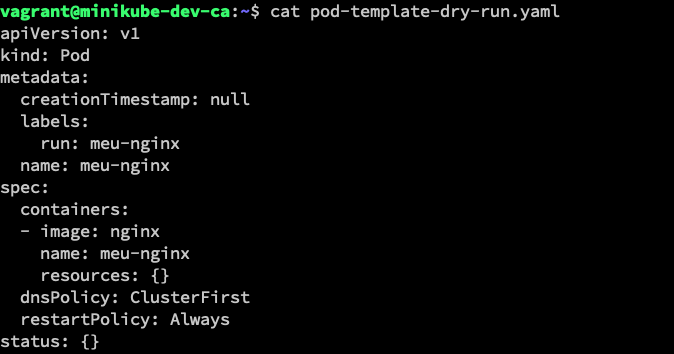

### Show documentation about Kubernetes resources

We can use the command `kubectl explain <resource>` to show the documentation about Kubernetes resources like pod.

Example: `kubectl explain pod`

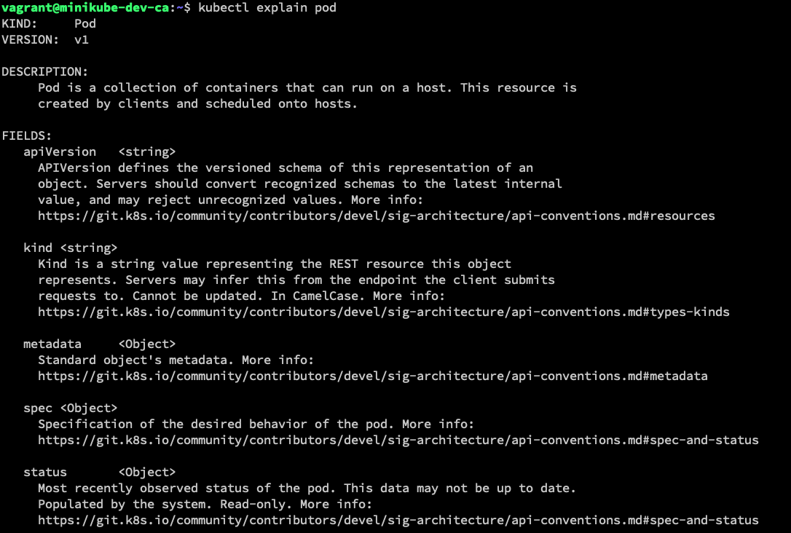

### Create a Service object that exposes the pod

`kubectl expose pod nginx`

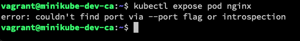

This error is showed due to the fact the k8s doesn't know what it the container destination port. Let's set it up.

`kubectl delete -f my-first-pod.yaml`

Generate a new file `my-pod-nginx-port.yaml` and add the below code.

```yaml
apiVersion: v1
kind: Pod
metadata:
  labels:
    run: my-nginx
  name: my-nginx
spec:
  containers:
    - image: nginx
      name: my-nginx
      ports:
        - containerPort: 80
      resources: {}
  dnsPolicy: ClusterFirst
  restartPolicy: Always
status: {}
```

Run `kubectl create -f my-pod-nginx-port.yaml`

Make sure the pod is running: `kubectl get pod`

Run `kubectl expose pod my-nginx`

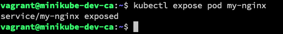

Show the services: `kubectl get services`

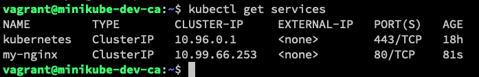

As the service type `ClusterIP` (we'll discuss the service types during the [Day2](Day2.md) ) can access services only inside the cluster, you'll need to ssh to the cluster running `minikube ssh`

Now run `curl 10.99.66.253`

The Nginx default page will be shown

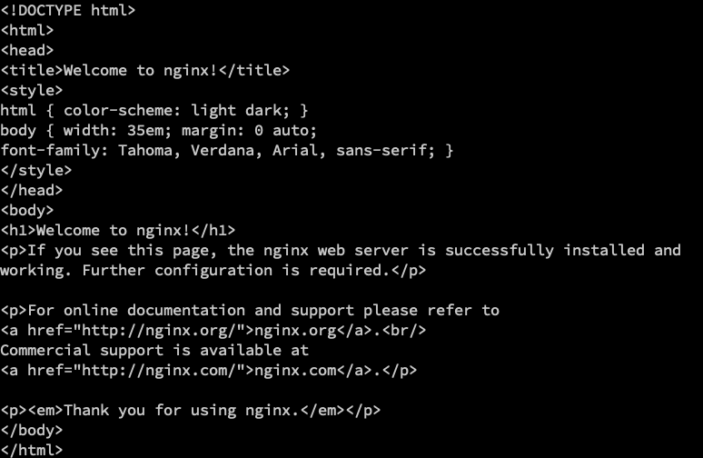

Type `exit`

### Clean up everything

Run `kubectl delete -f my-pod-nginx-port.yaml` to delete the nginx pod created.

Run `kubectl delete service my-nginx` to delete the nginx service created before.
